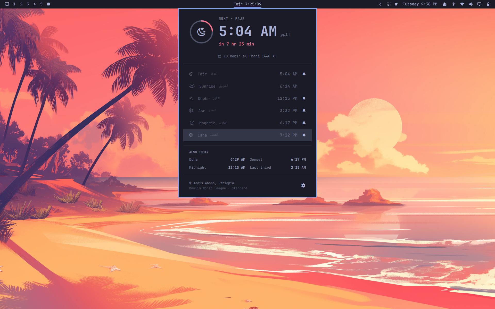
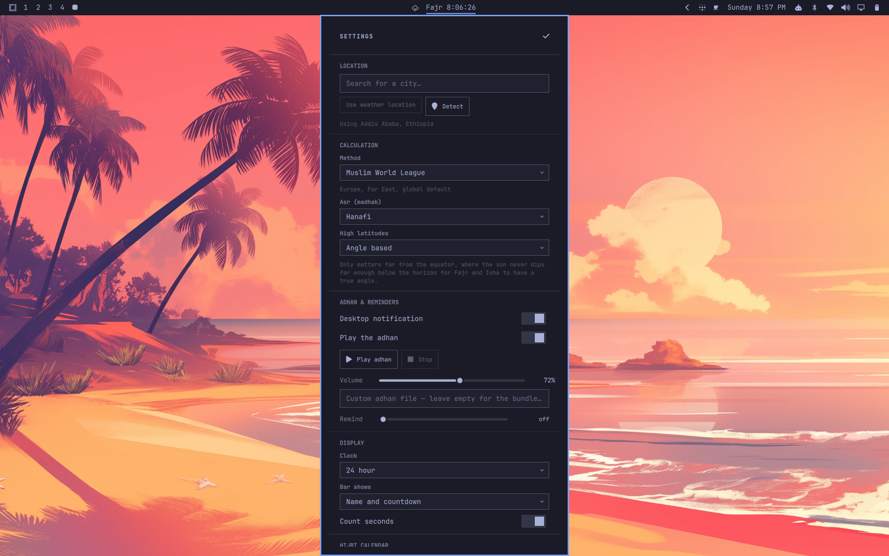

# Salah Reminder

[](https://github.com/sifenfisaha/omarchy-salah-reminder/actions/workflows/ci.yml)
[](LICENSE)

Prayer times in the Omarchy bar, with the adhan and the whole day one click away.



The bar shows the next prayer and a live countdown. Clicking it opens the day:
a progress ring through the current window, every prayer with its Arabic name,
the Hijri date, and the derived times that no timetable prints but everyone
eventually wants — Duha, Islamic midnight, and the last third of the night.

## Install

```bash
omarchy plugin add https://github.com/sifenfisaha/omarchy-salah-reminder.git --enable
```

Pick a bar section when prompted, or place it yourself afterwards:

```bash
omarchy bar move salah.reminder --section center
```

On first run the pill shows the plugin's mark. Click it, choose a location, and
it starts counting down.

### Requirements

All of these already ship with Omarchy; they are listed so nobody has to read
the source to find out what gets executed.

| Needs | Used for |
| --- | --- |
| `mpv` | Playing the adhan |
| `curl` | City search, the IP fallback, the daily Hijri correction, fetching a chosen voice |
| `omarchy-notification-send` | Desktop notifications |

None of the network calls are required. With a location set, Hijri sync off,
and the bundled voice chosen, the plugin never touches the network at all —
prayer times are computed locally. The default voice is the one exception: it
is fetched once, the first time the plugin runs.

### Removing it

```bash
omarchy plugin remove salah.reminder
```

That unloads it, takes it out of the bar, and leaves a timestamped backup
alongside. Your settings are deliberately left behind so a reinstall picks up
where you left off; clear them yourself if you want a clean slate:

```bash
rm -rf ~/.config/omarchy/salah ~/.local/state/omarchy/salah
```

The plugin writes nowhere else. It reads Omarchy's weather location but never
modifies it, and it does not touch `shell.json` or any other config of yours.

## Where it gets your location

In order:

1. A city you picked in the panel.
2. **Omarchy's weather location** — if you have already told the weather widget
   where you are, this uses the same answer. Most people never set a location
   twice.
3. An IP lookup, only if neither of the above exists.

## Calculation



Sixteen methods, all selectable in the panel: Muslim World League, Egyptian
General Authority, Umm al-Qura, Karachi, ISNA, Moonsighting Committee, Diyanet,
Singapore, the Gulf authorities, UOIF, Russia, Tehran, and Jafari. Asr follows
either the standard (Shafi'i, Maliki, Hanbali) or Hanafi shadow ratio.

Times are computed locally from the solar position — no network, no API, and it
keeps working on a plane. The engine implements the PrayTimes model, which is
what Aladhan and most published timetables derive from.

**Accuracy.** Checked against `api.aladhan.com` across five cities, three
seasons, seven methods and both madhabs — 42/42 exact for Addis Ababa, and every
remaining difference elsewhere is a single minute on a value that sits within
seconds of a minute boundary, where Aladhan and `adhan-js` disagree with each
other by more than either disagrees with this. `node test/times.test.js` pins
the behaviour.

If your mosque prints something slightly different, **Fine tuning** in the
settings nudges any prayer by up to an hour, and that offset is what the adhan
uses too.

### High latitudes

Above roughly 48° the sun stops dipping far enough below the horizon for Fajr
and Isha to have a true angle for part of the year. Four rules are offered;
*Angle based* is the default and matches what most apps do.

## The adhan

At each prayer you get a desktop notification and, unless you have turned it off
for that prayer, the adhan. The bell on each row in the day view toggles that
prayer on its own — Fajr silent on a work laptop, the rest audible, say.

The default voice is a live recording of the adhan from the Prophet's Mosque
in Madinah. It is not bundled: the first time the plugin runs it is fetched
from Wikimedia Commons, 2.8 MB, into `~/.local/state/omarchy/salah/adhan/` and
kept, and until it has arrived a 42-second CC0 recording that ships with the
plugin plays instead. **Voice** in the settings offers others, fetched the
same way the first time they are chosen: a live recording from Masjid
al-Haram in Makkah, a studio recitation by Aaqib Azeez, a mosque recording
from Nigeria, and the bundled recording itself for a plugin that never
touches the network. Every one carries a free licence, and the credit it asks
for is shown under the setting and listed in [NOTICE.md](NOTICE.md).

Recordings by the muezzins people ask for by name are copyrighted, so a free
plugin cannot ship them. Pick **A file of your own** and point it at anything
`mpv` can play instead.

Audio and notifications come from a single shell-wide service, so a multi-monitor
desk gets one adhan rather than one per screen. A prayer whose moment passed
while the machine was suspended is skipped rather than fired on resume.

## Hijri date

The panel shows the Hijri date from an arithmetic calendar, which drifts a day
against Umm al-Qura for stretches of several months. Left on, **Correct against
Umm al-Qura** checks once a day and remembers the correction, so the date stays
right afterwards even offline. Turn it off for a fully offline plugin and use the
manual shift instead.

Months begin on a local sighting, so mosques in one city can legitimately differ
by a day. The shift is there for that. Switching the correction off also forgets
whatever it had learned, so the shift you set is the whole shift.

## Command line

```bash
omarchy-shell salah today     # the whole table
omarchy-shell salah next      # next prayer and how long
omarchy-shell salah test      # play the adhan
omarchy-shell salah stop      # stop it
omarchy-shell salah sync      # re-check the Hijri date now

omarchy-shell salah.reminder toggle     # the panel
omarchy-shell salah.reminder settings   # straight to settings
```

Useful as Hyprland binds. Omarchy configures Hyprland in Lua, so these go in
`~/.config/hypr/bindings.lua`:

```lua
-- SUPER+P is "Pseudo window" by default, so unbind it before taking the key.
hl.unbind("SUPER + P")
o.bind("SUPER + P", "Prayer times", "omarchy-shell salah.reminder toggle")
o.bind("SUPER + SHIFT + ALT + P", "Silence adhan", "omarchy-shell salah stop")
```

Check what a key already does before claiming it — Omarchy binds most of the
obvious ones:

```bash
omarchy menu keybindings --print | grep -i "SUPER + P"
```

Hyprland reloads on save; `hyprctl configerrors` should come back empty.

Today's table is also written to `~/.local/state/omarchy/salah/state.json` as
ISO timestamps, for scripts that want it without reimplementing the astronomy.
Next to it, `announced.json` records which prayers have already been announced,
by day and minute, so neither a shell reload nor a restart plays an adhan twice,
and a prayer whose time you nudge after it sounded is announced again at the
new time.

## Configuration

Everything in the panel is stored in `~/.config/omarchy/salah/config.json`,
which is plain JSON and safe to hand-edit or keep in version control — the shell
picks up changes as you save.

| Key | Meaning |
| --- | --- |
| `location` | `{name, latitude, longitude, source}`; `source` is `manual`, `weather` or `ip` |
| `method` | `MWL`, `Egypt`, `Makkah`, `Karachi`, `ISNA`, `Moonsighting`, `Turkey`, `Singapore`, `Gulf`, `Dubai`, `Kuwait`, `Qatar`, `France`, `Russia`, `Tehran`, `Jafari` |
| `madhab` | `Standard` or `Hanafi` |
| `highLats` | `AngleBased`, `NightMiddle`, `OneSeventh`, `None` |
| `tune` | Per-prayer correction in minutes |
| `azan` | Per-prayer adhan on/off |
| `audio` | `{enabled, adhan, path, volume}` — `adhan` is a voice id (`madinah` by default, `makkah`, `aaqib-azeez`, `nigeria`, `bundled`) or `custom`, which plays `path`; `volume` is an mpv percentage, so above 100 amplifies |
| `notify` | Desktop notification on/off |
| `reminderMinutes` | Heads-up this many minutes before; `0` disables |
| `hijriOffset` | Your own shift, −2 to +2 days |
| `hijriSync` | Daily correction against Umm al-Qura |
| `timeFormat` | `24h` or `12h` |
| `barMode` | `countdown`, `time`, or `both` |
| `showSeconds` | Seconds in the bar countdown |

## Layout

```
manifest.json          plugin declaration — one service, one bar widget
Service.qml            the only part that acts: adhan, notifications, lookups, state files
BarWidget.qml          the bar pill
Panel.qml              the day view and settings
components/            reusable QML used by the panel
lib/PrayerTimes.js     solar position, the method table, the schedule
lib/Hijri.js           Hijri conversion
lib/Model.js           config shape, formatting, the day model
assets/adhan.ogg       bundled call to prayer (CC0)
test/                  regression tests, plain node, no network
docs/                  screenshots and ARCHITECTURE.md
```

The bar widget and the panel each compute times themselves from the same config
file rather than asking the service, so the bar is still correct if the service
is disabled, and the two can never disagree. Every write replaces the file
atomically, so a watcher never sees it half-written, and a file that fails to
parse is ignored rather than treated as a fresh default.

## Contributing

Bug reports, fixes, new calculation methods and better wording are all welcome.
[CONTRIBUTING.md](CONTRIBUTING.md) covers running your own copy, the checks to
run, and the conventions; [docs/ARCHITECTURE.md](docs/ARCHITECTURE.md) explains
how the pieces fit and lists the Quickshell behaviours that have bitten this
code before. The short version:

```bash
git clone https://github.com/sifenfisaha/omarchy-salah-reminder.git \
  ~/.config/omarchy/plugins/salah.reminder
omarchy restart shell         # after every change: the hot reload keeps cached code
node test/times.test.js       # sets its own timezone
omarchy plugin validate .     # the checks the shell enforces
```

Changes are listed in [CHANGELOG.md](CHANGELOG.md).

## Licence

MIT, except the bundled recording — see [NOTICE.md](NOTICE.md).
